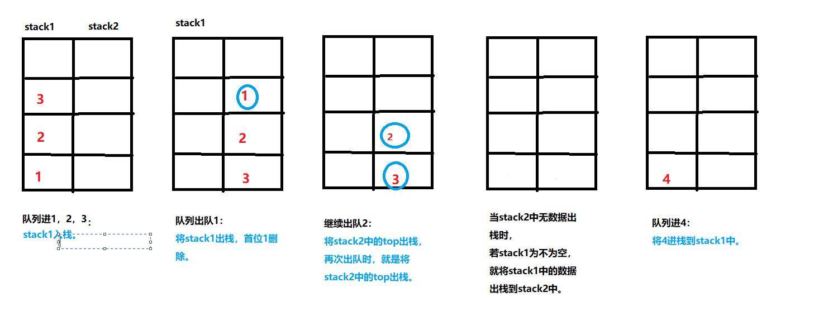
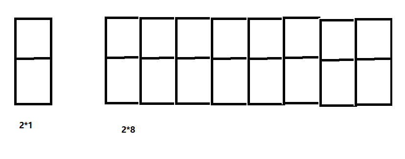
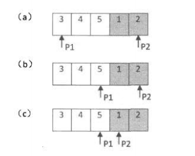
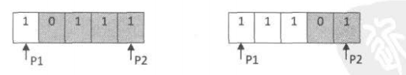

# 剑指offer个人总结

---

##### 第一章 面试流程

###### 1.1 把一个字符串转换为整数。

######  1.2 求链表中的倒数第K个结点（面试题中有）。

----

##### 第二章 面试需要的基础知识
###### 2.1.  考虑sizeof(class )的结果。

定义一个空类型，空类型中有构造和析构函数，空类型有虚函数时，sizeof()为多少。

###### 2.2. 考虑下面代码的运行情况。

​				选项：A:编译错误 B:编译成功，运行程序崩溃 C:编译运行正常，输出10。

```C
class A
{
    private:
    int value;

    public:
    A(int n)
    : value(n){}
    A( A& other )
    //A( A other) //形参传值，会拷贝赋值
    {
        value = other.value;
    }

    void Printf()
    {
        std::cout << this->value << std::endl;
    }

};
int main(int arggc, char* argv[])
{
    A a = 10;
    A b = a;
    b.Printf();

}
//拷贝构造函数不允许赋值其构造函数。
```
###### 面试题1：重写赋值运算符

> 如下为类型CMyString的声明，请为该类型添加赋值运算符函数
>
> ```c++
> class CMyString
> {
>  public:
>  CMyString(char* pData = nullptr);
>  CMyString(const CMyString& str);
> 
>  private:
>  char* m_pData;
>  usigned int m_Size;
> };
> ```

**总结：**

注意：

1. 链式表达。

2. 防止传入的参数生成副本，误改参数数据。

3. 避免内存泄漏。

4. 特殊情况就是自己传入自己，把自己的内存释放了。

###### 面试题2：设计模式是 💦


###### 面试题3：找出数组中重复的数字

> 例题1：在一个长度为n的数组里所有数字都在0~n-的范围内。
>  数组中某些数字是重复的，但是不知道有几个数字重复，
>  也不知道每个数字重复了几次。
>  请找出数组中任意一个重复的数字
>  例如：
>  输入长度为7的数组{2， 3， 1， 0， 2， 5， 3},那么对应输出的重复数字应该为2或者3。

**思路1：**

将数组中的值视为数组的下标。（ a[0]=0, a[1]=1, a[2]=2, a[3]=3 ... ）

从头开始遍历数组。 

当数组的下标与此下标的内容一致时，---> 扫描数组的下一位。

当数组的下标与此下标的内容不一致时，根据下标的内容 查找 以下标内容为下标的数组 中所存储的内容

​                  查找结果为 以下标内容为下标的数组中所存储的内容 本来就等于 下标的内容。---> 找到重复目标数字，结束程序。

​                  查找结果为 以下标内容为下标的数组中所存储的内容 不等于 下标的内容。 交换以下标内容为下标的数组中所存储的内容 与 下标的内容。---> 继续扫描下一位数组。

**思路2：**

将数组进容器，排序，使用sdjacent_find()。


> 例题2：在一个长度为n的数组里所有数字都在0~n-的范围内。
>  数组中某些数字是重复的，但是不知道有几个数字重复，
>  也不知道每个数字重复了几次。
>  请找出数组中任意一个重复的数字
>  例如：
>  输入长度为7的数组{2， 3， 1， 0， 2， 5， 3},那么对应输出的重复数字应该为2或者3。

**思路：**

使用二分查找法：（找出的重复数字不全）

由题意得，至少有一个数字是重复的，即我们就统计1~n之间，这个多出来的数字是出现在哪个数段的。

起先，start=0, end=n， middle = (end-start)<<1+1;

统计数组中，在(start, middle)中的数字数目，若大于middle-start + 1,则重复数字必在此(start, middle)区间，将end=middle, 重复此操作。直到start==end; 查询此区间是否还有数值符合要求。

​                      若小于middle-start + 1，则重复数字比在(middle+1, end)区间，将start=middle+1, 重复此操作。直到start==end; 查询此区间是否还有数值符合要求。

###### 面试题4：二维数组中的查找

> 示例1：
>
> 在一个二维数组中，每一行都按照从左到右递增的顺序排序，每一列都按照从上到下递增的顺序排序。
>  请完成一个函数，输入这样的一个二维数组和一个整数，判断数组中是否含有该整数。


> 示例2：
>
> 理解下面的代码
>
> ```c++
> int main(int argc, char* argv[])
> {
>     char str1[] = "hello world";
>     char str2[] = "hello world";   //从常量字符串的存储区域，赋值一份数据，拷贝到新开辟的栈区
> 
>     char* str3 = (char*)"hello world";
>     char* str4 = (char*)"hello world"; //指针无需分配地址，常量字符串的存储区域直接指向
> 
>     if ( str1 == str2 )
>     {
>         std::cout << "str1 and str2 are same" << std::endl;
>     }
>     else
>     {
>         std::cout << "str1 and str2 are not same" << std::endl;
>     }
> 
>     if ( str3 == str4 )
>     {
>         std::cout << "str3 and str4 are same" << std::endl;
>     }
>     else
>     {
>         std::cout << "str3 and str4 are not same" << std::endl;
>     }
>     return 0;
> }
> ```
>
> 


###### 面试题5：替换空格

> 请实现一个函数，把字符串中的每个空格替换成"%20"。
> 例如：输入"We are happy." ,则输出"We%20are%20happy."

**思路1：**

1. 过程：

   从前往后赋值，时间复杂度为O(n^2)。

思路2：

1. 过程：

   从后往前赋值，时间复杂度为O(n)。

   先确定字串转换后的尾指针指向到哪里，然后再遍历。

   然后p1指针指向复制完成的子字串最前面一位的再前面一位。

     p2指针指向预留空白空间的首字符。

   当p1和p2相遇后，即留给"%20"的字串填充完毕。


###### 2.3  往该链表的末尾添加一个节点。

思路：

前提：头节点存放数据

过程：将p指针指向链表的头节点，逐一遍历，

当遍历的下一个指针指向为NULL，停止遍历。

当前位置的下一个节点指向创建的新节点。

注意：

1）在这里，有一个非法输入，即输入为NULL;

2）此链表为空时，即头指针直接指向新节点。

3）由于要修改地址，即我们将传入参数是地址的地址。


###### 2.4  在链表中找到一个含有某个值的节点并删除该节点。

思路：

前提：头节点存数据。

过程：逐一遍历。

注意：

1）避免非法输入。即空指针作为参数输入。

2）由于要更改头指针的指向，故传入参数为指针的指针。

那么为啥子要从头节点的下一位找呢？

因为我们遍历的时候取得是目标数据的前，而头节点没有前一位啊！！！

3）由于涉及的遍历是从头节点的下一个节点开始的，故当目标数据在头节点时，要单独处理。


###### 面试题6：从尾到头打印链表。

> 输入一个链表的头节点，从尾到头反过来打印出每一个节点的值。
> 链表节点定义如下：
>
> ```c++
> struct ListNode
> {
>     int m_nKey;
>     ListNode* m_pNext;
> };
> ```

**思路1**：改变链表结构

			1. 过程：
			改变链表的数值存放，将尾数据和头数据之间的数据反转过来。

**思路2**：不改变链表结构（栈）
1. 过程：

不改变链表的数值存放，直接从链表尾往前遍历。最先一个遍历的节点，最后那一个显示出来，这样我们就想到了栈（先进后出）。

2. 注意：
   	1）避免非法输入，即空指针作为参数传入。

**思路3**：不改变链表结构（递归）
  		1. 过程：
       	递归在本质上就是一个栈结构，由此想到了用递归实现。
       	当访问一个节点时，先输出显示此节点的后一个节点中的数据，再输出自身的数据。
  		2. 缺点：
       当链表过长时，会导致函数调用的层级很深，可能导致函数调用栈溢出。


###### 面试题7 重建二叉树 啊💦

###### 面试题8 二叉树的下一个节点是💦 

###### 面试题9 栈和队列

> 题目：用两个栈实现一个队列。
>
> 队列的声明如下，请实现它的两个函数`appendTail` 和 `deleteHead`，分别完成在队列尾部插入节点和队列头部删除节点的功能。
>
> ```c++
> template <typename T> class CQueue
> {
>   public:
>   CQueue(void);
>   ~CQueue(void);
>   
>   void appendTail(const T& node);
>   T deleteHead();
>   
>   private:
>   stack <T> stack1;
>   stack <T> stack2;
> }
> ```

思路：两个栈里面，将一个栈当成进队容器，另一个栈当成出队容器。



> 扩展：用两个队列实现一个栈。
>
> 队列的声明如下，请实现它的两个函数`appendTail` 和 `deleteHead`，分别完成在队列尾部插入节点和队列头部删除节点的功能。
>
> ```c++
> template <typename T> class CStack
> {
>  public:
>  CStack(void);
>  ~CStack(void);
> 
>  void push(const T& node);
>  T pop();
> 
>  private:
>  std::queue <T> queue1;
>  std::queue <T> queue2;
> };
> ```

思路:

就是将两个队列来回的存放数据，保持一个容器为空，一个容器放数据，

当需要出栈时，将放数据的队列全部出队到为空的容器中，再舍弃出队中队列中的最后一个数据。

当需要压栈时，往放数据的队列中压栈。


###### 2.5 计算 1+2+3+4…+n

思路1：递归

缺点：1）有时间和空间的消耗。

   2）也许会出现栈溢出。

思路2：循环

思路3：数学技巧

###### 面试题10：斐波那契数列

题目一：求斐波那契数列的第n项。写一个函数，输入n，求斐波那契数列（Fibonacci）数列的第n项。

题目二：青蛙跳台阶。

一只青蛙可以跳上一级台阶，也可以跳2级台阶。求该青蛙跳上一个n级的待解总共有多少种跳法。

题目二：扩展

一只青蛙可以跳上一级台阶，也可以跳2级台阶...他也可以跳上n级。求该青蛙跳上一个n级的待解总共有多少种跳法。

思路：数学归纳法可以证明 f(n) = 2^(n-1)。

题目三：填充格子

用2*1的小长方体横着或者竖着去覆盖更大的矩形，不可重叠，有多少种方法。



思路：首先需要8个小矩形去覆盖，记作f(8), 第一块有两种防止覆盖，

一种是竖着覆盖，即之后，就剩余7个小矩形空间。记作f(7)

一种是横着覆盖，那么它下面的就也必须是横着，所有就剩余6个小矩形空间，记作f(n-2),

当我们需要覆盖n个小矩形空间的矩形时，记作f(n)，会得出f(n) = f(n-1) + f(n-2)。

实际就是斐波那契数列。


###### 2.6 快速排序

###### 2.7 员工年龄排序问题

思路：

创建一个新的数组，此数组下标为年龄大小，每个下标存储的是此年龄的人数。

通过遍历存放每个人年龄的数组,填充新数组。

在通过遍历新数组更改原来的数组。

###### 面试题11，旋转数组的最小数字

把一个数组最开始的若干个元素搬到数组的末尾，我们称为数组的旋转。

输入一个递增排序的数组的一个旋转 输出旋转数组的最小元素。

例如数组{3， 4， 5， 1， 2}为{1， 2， 3， 4， 5}的一个旋转，该数组的最小为1。

一般情况：



特殊情况：这个时候就只能使用普通的遍历了。（顺序查找）



###### 面试题12：矩阵中的路径的💦

###### 面试题13：机器人的运动范围的💦

###### 面试题14：剪绳子

题目：给你一根长度为ｎ的绳子，请把绳子剪成ｍ段（ｍ，ｎ都是整数，ｎ＞１并且ｍ＞１），每段绳子的长度记为ｋ［０］，ｋ［１］，．．．，ｋ［ｍ］。

请问ｋ［０］＊ｋ［１］＊．．．＊ｋ［ｍ］可能的最大乘积是多少？

例如：当绳子的长度是８时，我们把它剪成长度分别为２，３，３的三段，此时得到的最大乘积是１８。

方法一：动态规划

反向递归。将之间的情况先求出来。

方法二：贪婪算法

就是最大的使用最优的数去相乘，就是尽可能的有数字3去相乘，然后当余数为1时，1+3 ==》1+3 的情况要小于 2+2 ==》2*2。

###### 面试题１５：二进制中１的个数

题目：请实现一个函数，输入一个整数，输出该数二进制表示中1的个数。

例如：数字9表示二进制为1001，有2位是1。因此，如果输入为9，则该函数输出为2。

思路：

方法一：通过右移被测数，查看被测数每一位是否为0----》忽略了被测数是负数的情况。

方法二：避免被测数右移，故设置一个标志位1，通过标志位左移，被测数不动，检测被测数每一位是否为1---》当被测数规模较大时，工作量加大。

方法三：避免多次循环，将被测数二进制最后一位变为0，与原被测数相&，若结果不为0，则最末尾变为0的被测数中还有1的位数，故循坏上述过程。

###### 面试题１６：数值的整数次方

题目：实现函数double Power(double base, int exponent); 求base的exponent次方。

注意：

1）容易忽略负数幂次方。

2）特殊值，0的0次方，是无意义的，可以是0也可以是1；其他数的0次方为1。

还有一张方法是使用递归，但是理解不了。。。💦

###### 面试题１７：打印从１到最大的ｎ位数。💥

题目：输入数字ｎ，按顺序打印出从１到最大的ｎ位数十进制。

比如输入３，则打印１，２，３一直到最大３位数９９９。

思路1：常规方法

> **注意：**数字容易导致溢出问题，可是使用数组或者字符串表示大数呀呀呀！！！
>
> 在使用数组或者字符串表示大数时，有字串中的数字加1的操作函数和将字串输出显示的函数。
>
> `bool Increment(char* number); //字串加1`
>
> 要注意的是，判断字串是否超出了我们的规定范围。
>
> `void PrintNumber(char* number); //输出字串数字`
>
> 按照真正数字显示那样显示，不要将前面的0输出。
>
> ==设置一个中断标志位哦，遇到符合条件就开始执行一下==

思路2：

将n个数进行全排列,

递归结束的条件是我们设置了数字的最后一位。


